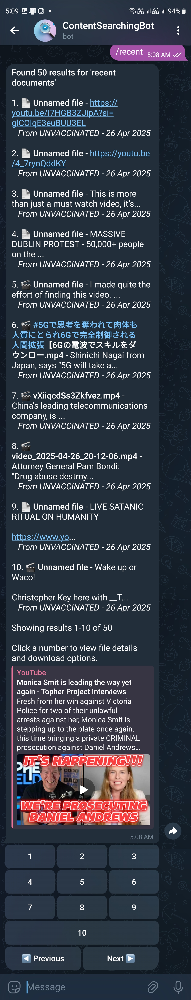
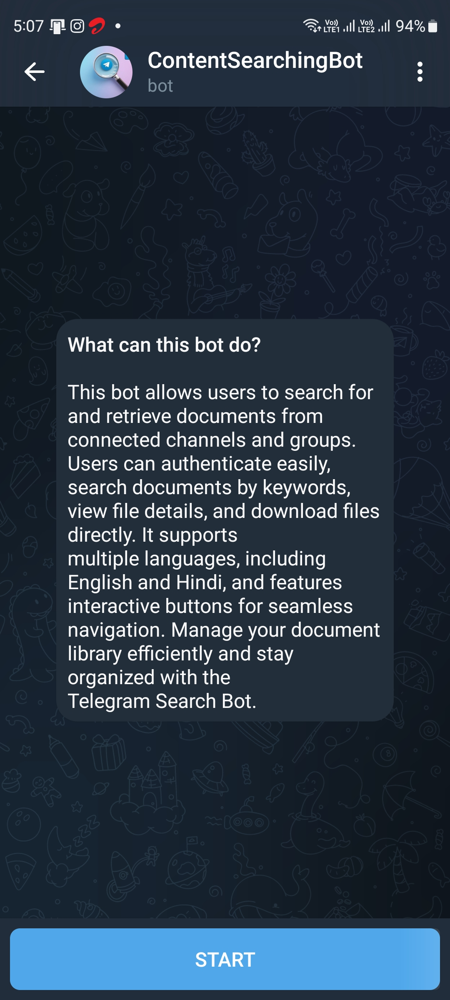
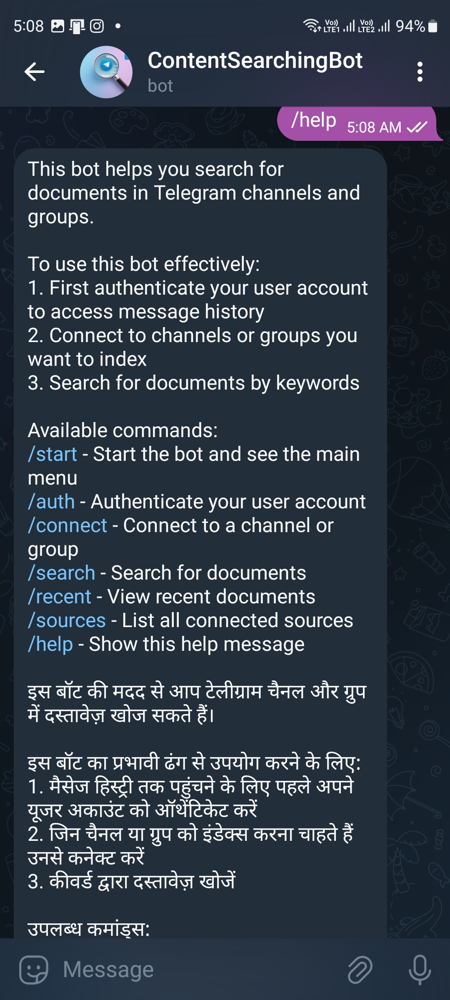

# Telegram Search Bot

A Telegram bot that collects and organizes documents from Telegram groups and channels, providing a searchable interface.

## Features

- Collect documents and files from Telegram groups/channels
- Organize similar files and remove duplicates
- Search functionality to find documents by keywords
- Website-like interface through inline buttons

## Setup

1. Clone this repository
2. Install dependencies:
   ```
   pip install -r requirements.txt
   ```
3. Create a `.env` file with:
   ```
   API_ID=your_telegram_api_id
   API_HASH=your_telegram_api_hash
   BOT_TOKEN=your_bot_token
   MONGO_URI=your_mongodb_connection_string
   Phone_number=Your Phone Number
   ```
4. Get your API credentials from https://my.telegram.org/apps
5. Create a bot and get the token from @BotFather
6. Set up MongoDB (local or Atlas)

## File Structure

- `bot.py` - Main bot code
- `website/` - Front-end website files
- `requirements.txt` - Python dependencies
- `README.md` - Project documentation
- `.env` - Environment variables file
- `screenshots/` - Example screenshots

## Usage

1. Run the bot:
   ```
   python bot.py
   ```
2. Start a chat with your bot on Telegram
3. Follow the bot's instructions to connect to groups/channels
4. Use search commands to find documents

## Commands

- `/start` - Show main menu
- `/help` - Show help information
- `/connect` - Connect to a new group/channel
- `/search` - Search for documents (type keywords directly or use Search button)
- `/recent` - Show recent documents
- `/sources` - List connected sources

---

## License

This project is licensed under the [Creative Commons Attribution-NonCommercial 4.0 International (CC BY-NC 4.0)](https://creativecommons.org/licenses/by-nc/4.0/).

[](https://creativecommons.org/licenses/by-nc/4.0/)

## Screenshots

| Home | Search Results | Telegram Post Preview |
|------|---------------|----------------------|
|  |  |  |
